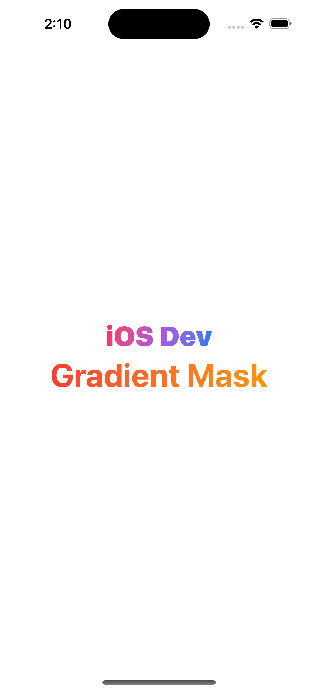

# 🎨 Gradient Text in SwiftUI

Learn how to apply color gradients to text using SwiftUI.

## 📌 Techniques

- Use `.foregroundStyle` (iOS 16+)
- Use `.overlay + .mask` for backward compatibility (iOS 14+)

## 🔍 Examples

### Using `foregroundStyle`
```swift
Text("SwiftUI Gradient Text")
    .font(.largeTitle)
    .fontWeight(.bold)
    .foregroundStyle(
        LinearGradient(
            colors: [.purple, .blue],
            startPoint: .leading,
            endPoint: .trailing
        )
    )
```

### 📷 Screenshot

