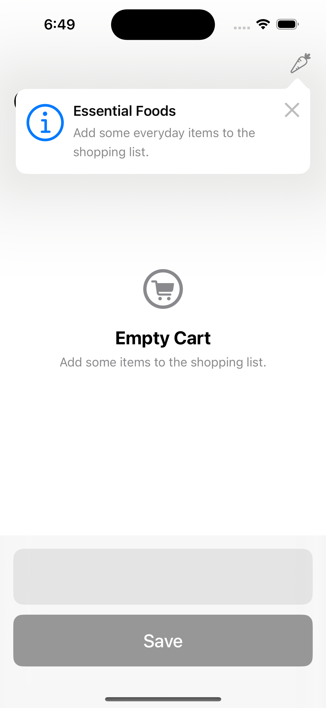
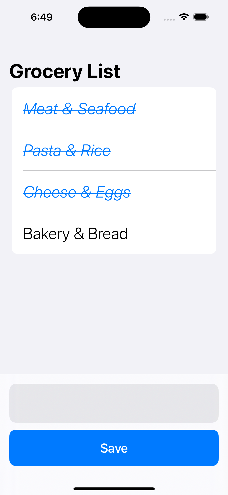

# 🛒 Grocery List App

A modern, lightweight SwiftUI app to manage your grocery shopping list. This app uses **SwiftData** for local persistence and **TipKit** to guide users with contextual UI tips.

---

## 📱 Features

* 📝 Add grocery items with a title and completion status.
* ✅ Swipe to mark items as **done/undone**.
* 🗑️ Swipe to **delete** items.
* 🛍️ One-tap to populate list with **essential foods**.
* 💡 Integrates **TipKit** to display helpful UI hints.
* 🧠 Remembers your list using **SwiftData** with no backend required.
* 🧪 Includes preview support for both sample and empty states.

---

## 📦 Tech Stack

| Feature         | Framework           |
| --------------- | ------------------- |
| UI              | SwiftUI             |
| Persistence     | SwiftData (iOS 17+) |
| Contextual Help | TipKit              |

---

## 🛠 Setup Instructions

### Requirements

* Xcode 15+
* iOS 17+
* Swift 5.9+

### Steps

1. Clone the repository or copy the code into a new SwiftUI project.
2. Ensure `SwiftData` and `TipKit` are enabled (iOS 17+ only).
3. Run the app in an iPhone simulator or physical device.

---

## 🧱 Project Structure

```
Grocery_ListApp
├── Grocery_ListApp.swift        # App entry point
├── Item.swift                   # SwiftData model for grocery items
├── ButtonTip.swift              # TipKit tip shown for 'Essentials' button
└── ContentView.swift            # Main UI and business logic
```

---

## ✨ SwiftData Model

```swift
@Model
class Item {
    var title: String
    var isCompleted: Bool
    
    init(title: String, isCompleted: Bool) {
        self.title = title
        self.isCompleted = isCompleted
    }
}
```

* `title`: Name of the grocery item.
* `isCompleted`: Whether the item is marked as purchased.

---

## 📋 UI Flow

* On launch, users see an empty grocery list.
* If no items exist, a TipKit tip suggests adding **essential foods**.
* Users can:

  * Add a custom item via the bottom input bar.
  * Use swipe gestures to mark items as completed or delete them.
  * Tap the **carrot icon** to populate essential groceries.

---

## 💡 TipKit Integration

* `ButtonTip` appears above the **"Essentials"** button when the list is empty.
* Uses `.popoverTip()` modifier.

---

## 🎯 Previews

Two SwiftUI previews are included:

* ✅ `Empty List`: For testing a clean startup view.
* 🧪 (Commented out) `Sample List`: Preview with predefined grocery items.

---

## 🧹 Known Improvements

* [ ] Add iCloud syncing for shared grocery lists.
* [ ] Enable drag & drop to reorder items.
* [ ] Add due dates or reminders.

---

## 🤝 Contribution

Feel free to fork and customize the app. PRs are welcome for improvements or new features!

---

## 📸 Screenshots (Optional)




---
