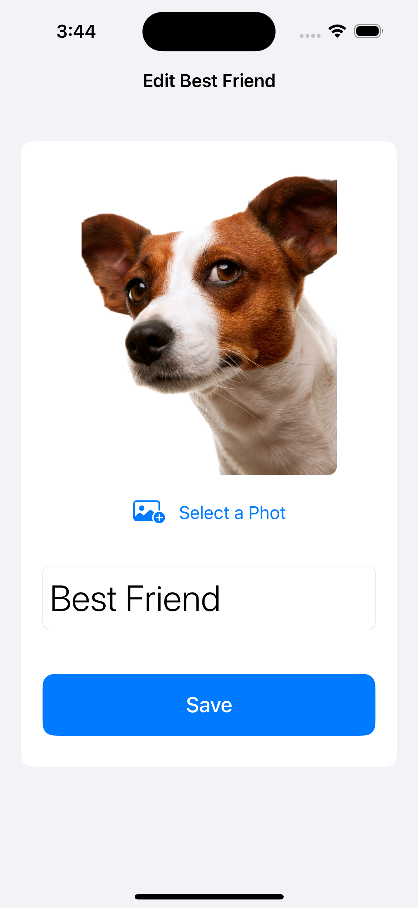
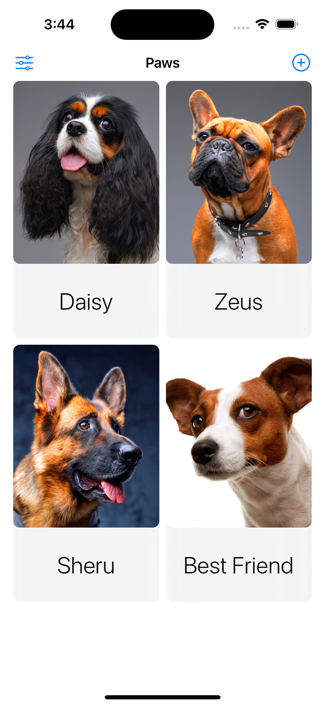

# 🐾 Paws – SwiftUI + SwiftData Pet Tracker

Paws is a simple iOS app built with SwiftUI and SwiftData that lets you track your favorite pets. Add, edit, and delete pets with names and photos. Data is stored locally using Apple's modern SwiftData framework.

---

## ✨ Features

- 📸 Add and edit pet photos using the system photo picker
- 📝 Update pet names inline
- 🗂️ Display pets in a beautiful two-column grid
- 🧹 Delete pets in edit mode
- 🔁 Local persistence with SwiftData
- 👀 Seamless previews with sample data
- 💡 Graceful handling of empty states

---

## 🧱 Architecture

- **SwiftUI**: For declarative and reactive UI.
- **SwiftData**: For local persistence and querying.
- **MVVM-lite**: View logic is clean and inside SwiftUI views.
- **PhotosUI**: For native photo selection.
- **Xcode Previews**: Simulated preview environments using in-memory containers.

---

## 🗂️ Folder Structure

```plaintext
PawsApp/
├── PawsApp.swift              # App Entry
├── Models/
│   └── Pet.swift              # Pet model & sample data
├── Views/
│   ├── ContentView.swift      # Main list view
│   ├── EditPetView.swift      # Form to edit pets
│   └── CustomContentUnavailableView.swift  # Reusable empty state

```


## 📸 Screenshots (Optional)




---
