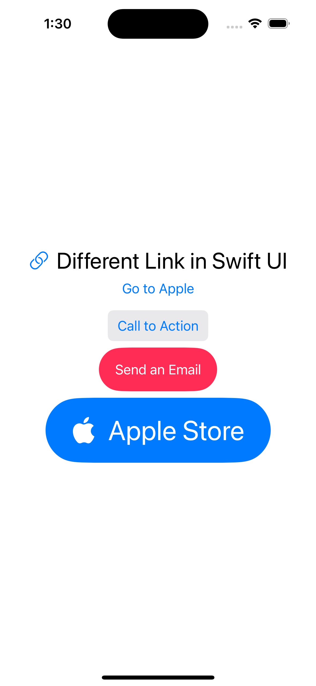

# UILink in SwiftUI

SwiftUI provides a built-in `Link` view to open URLs (webpages, mailto, etc.).

## 📌 Examples

- Open a website using a plain `Link`
- Customize the appearance of a `Link`

### 📷 Screenshot

### 🔗 Swift Code

- [LinkExample.swift](./LinkExample.swift)
